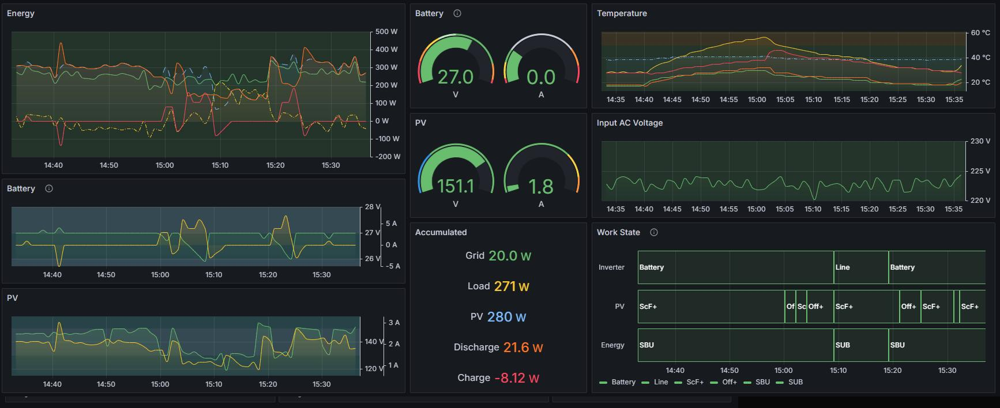

# Home Inverter Grafana Monitor

A home monitoring solution for your modus-compatible home inverter. (I have Green Cell)

How to use:

1. Prepare a raspberry PI Zero 2W (or any other single-board computer)
2. Connect a USB-B cable to your Inverter USB port
3. Go root (`sudo su`)
4. Install docker & docker-compose on it as well as other prerequisties
   ```bash
   curl -fsSL https://get.docker.com -o get-docker.sh
   chmod +x get-docker.sh
   ./get-docker.sh
   pip install "cython<3.0.0" wheel --break-system-packages
   pip install "pyyaml==5.4.1" --no-build-isolation --break-system-packages
   pip3 install docker-compose --break-system-packages
   pip install docker==6.1.3 --break-system-packages
   ```
5. Clone this repo
   ```bash
   git clone https://github.com/IhorKostiv/home-inverter-grafana-monitor
   cd home-inverter-grafana-monitor
   ```
6. Change `INVERTER_MODEL` on the [compose file](./docker-compose.yml) according to your model.
7. Go into the repo folder and do `docker-compose up -d`
8. Give it ~~20m to install everything and boot
9. Open `http://<rasperry-ip>:3000` and login with `admin/admin`
10. You should be redirected to an empty list of dashboards. Click New -> Import
11. Select [this file](./home-dashboard-AGM24.json) if you have 24v model



# Supporter Inverters

* GreenCell `GreenCell`

# But I have different model

1. Figure out the MODBUS device ID of your model, and the BAUD rate.
2. Look up the datasheet for register IDS that correspond to voltages etc,
   as specified in [monitor.py](monitor/monitor.py) (see offsets, e.g. 25200 + register ids)
3. Use [help/modbus.py](./help/modbus.py) script to figure out the register values as they work for you
   ```
   help/modbus.py <device id> <baud rate> <register from> <register to>
   # eg, pv1800
   help/modbus.py 4 19200 25200 25275
   # ep3000
   help/modbus.py 10 9600 30000 30025
   ```
4. Modify [monitor.py](monitor/monitor.py) to support your  `INVERTER_MODEL`, deploy as usual. Change `INVERTER_MODEL` 
   in the [compose file](./docker-compose.yml).
5. Open a Pull Request so others can benefit from your work.

# I want notifications when power goes out

1. Create a bot on Telegram using https://t.me/BotFather
2. Create a new group with only you and that bot
3. Copy [the group Id](https://stackoverflow.com/a/49852274)
4. Open http://<ip>:3000/alerting/notifications
5. Select telegram as type, fill in token and group id, save the contact point.
   Select Notification policies, Select Default, click Edit, change contact point to Telegram
6. Edit e.g. the Input AC Panel: click Alerts -> Create Alert
7. Change Threshold to BELOW 100.
8. Click SAVE on the Dashboard
